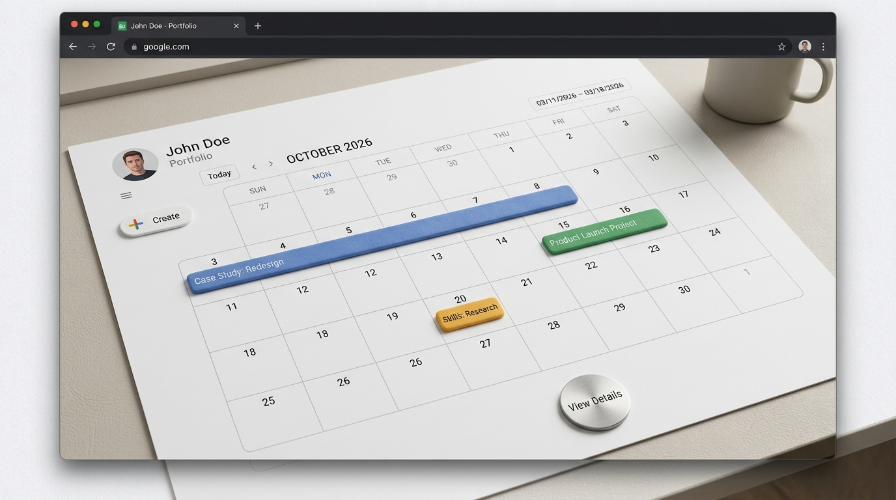

# Data Entry & Spreadsheet Management

## Overview

A sample data-entry and spreadsheet-management workflow demonstrating how I organize, clean, and maintain information accurately.

## Tasks Demonstrated

- Data entry and organization
- Spreadsheet formatting
- Sorting and filtering
- Record management
- Basic data validation
- Information tracking

## Tools Used

- Microsoft Excel
- Google Sheets

## Skills Demonstrated

- Data accuracy
- Attention to detail
- Spreadsheet management
- Organization
- Administrative support

> Note: This is a portfolio practice project using fictional information.
> 
