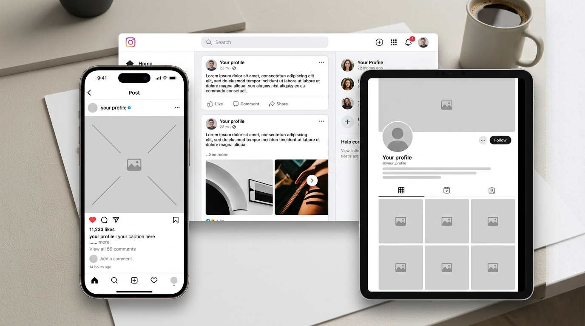

# Social Media Management

## Overview

A sample social media management workflow demonstrating how I plan, organize, and schedule content for a client.

## Tasks Demonstrated

- Content planning
- Social media scheduling
- Caption writing
- Hashtag research
- Content calendar management
- Audience engagement tracking

## Platforms

- Instagram
- Facebook
- LinkedIn

## Skills Demonstrated

- Content creation
- Social media management
- Copywriting
- Organization
- Audience engagement
- Administrative support

> Note: This is a portfolio practice project using fictional information.
> 
